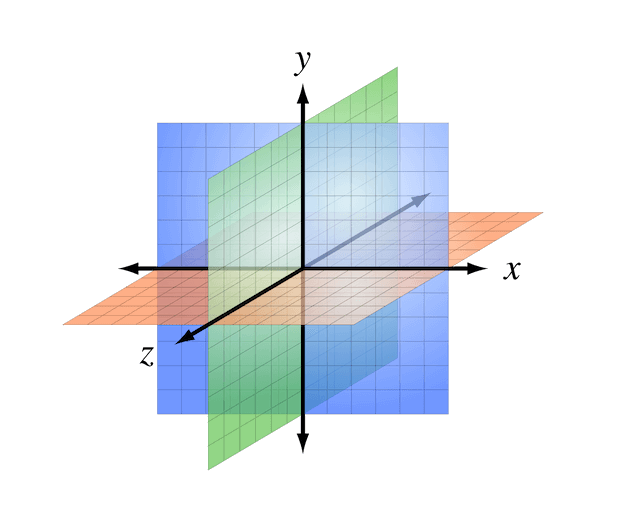
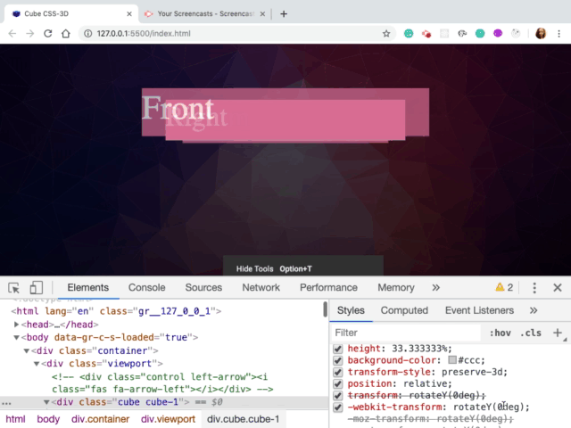
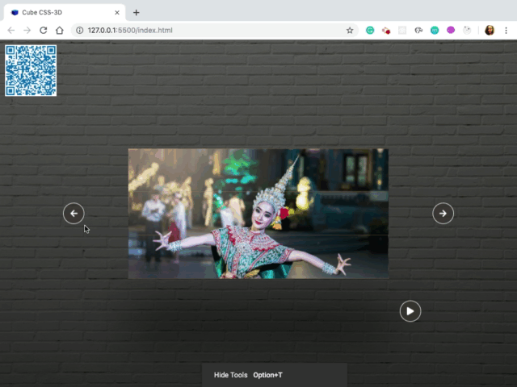

# CUBE CSS-3D
* This Project I'll create slideshow represented by 3D cube.
* Project will be based on HTML, CSS and JavaScript.
* Hover left arrow or right arrow cube will be rotated.
* Click play : slide will start show automatically or can say each cube will be start rotated.
* Click pause : slide will be stop. 

### HTML structure
The cube has six divs (or “sides”), absolutely positioned. The class names correspond to the initial positions of the sides (back, left, right, top, bottom, front).



#### A right-handed three-dimensional Cartesian coordinate system with the z-axis pointing towards the viewer. (Image: Wikimedia Commons) (View large version)

### Viewport Width and Height (vw) 
- Allow us to make CUPE responsive in a very flexible way. For example if width of viewport is decreased then size of height will be decreased accordingly. So if we make windows small then we will see that width and height of viewport are decreasing accordingly.

### The Perspective Property
* Create a 3D space for cube.
* Each 3D element with z>0 becomes larger; 
* Each 3D-element with z<0 becomes smaller. 
* The strength of the effect is determined by the value of this property.

### CSS transform-style Property
* Each cube should take up 1:3 of viewport because will have 3 cube.
* So, in 100% of height, will use 100/3 = 33.333333%
* preserve-3d :	Specifies that child elements will preserve its 3D position

```
.cube {
    width: 100%;
    height: 33.333333%;
    background-color: #ccc;
    transform-style: preserve-3d;
}

```

### Front and Back
Place parts of cube on their position in 3D space.
* Move this face from center to front
* Translate this element along Z 
* Insert here a positive value that it will move element close to user and opposite in case of negative value.
* So as a value we need to insert 21vw.
* By default phrase is placed in the center of 3D environment
* Defined width of cube as 42vw an actually a length of cube should be 42 vw 
* In order to get it shape of a real cube in fact this is going to be cuboid not the cube but for simplicity
* So to make lenght 42vw, need to move Front-face and  Back-face by 21vw because they are place in the center of view


```
.cube {
     transform: rotateY(0deg);
}

.front {
    transform: translateZ(21vw);
}

.viewport {
    width: 42vw;
    height: 21vw;
}

.back {
    transform: translateZ(-21vw) rotateY(180deg);
}
```

*  Change value rotate.
* Will see value is increasing and elements are moving accordindingly in 3-D space


### click left and right arrow
* Rotate 3 cube.
* ES6 Cover it back to an Array using; Array.from() or using the spread operator ...
* Loop : forEach
* Transition nicer : use transition in style CSS because on 1st click is happend only one I indicated as a value just 90 degrees then on 2nd click is already rotated by 90 degrees.So that's why don't have other rotation.


```

   const cubes = document.querySelectorAll('.cube');
    console.log(cubes); //NodeList(3) [div.cube.cube-1, div.cube.cube-2, div.cube.cube-3]

    //ES6 Cover NodeList back to an Array using by using the spread operator ...
    var backToArray= [...cubes]
    console.log(backToArray); //(3) [div.cube.cube-1, div.cube.cube-2, div.cube.cube-3]

    //ES6 Cover NodeList back to an Array using Array.from()
    var array = Array.from(cubes)
    console.log(array); //(3) [div.cube.cube-1, div.cube.cube-2, div.cube.cube-3]

```
```
document.querySelector('.left-arrow').addEventListener('click', () => {
    // console.log("click on left")
    const cubes = document.querySelectorAll('.cube');
    console.log(cubes);
    [...cubes].forEach(cube => cube.style.transform = 'rotateY(90deg');
});

```
* style CSS : use different delay time 
```
.cube-1 {
    transition: transform .4s;
    -webkit-transition: transform .4s;
    -moz-transition: transform .4s;
    -ms-transition: transform .4s;
    -o-transition: transform .4s;
}

.cube-2 {
    z-index: 10;
    transition: transform .4s .2s;
    -webkit-transition: transform .4s .2s;
    -moz-transition: transform .4s .2s;
    -ms-transition: transform .4s .2s;
    -o-transition: transform .4s .2s;
}

.cube-3 {
    transition: transform .4s .4s;
    -webkit-transition: transform .4s .4s;
    -moz-transition: transform .4s .4s;
    -ms-transition: transform .4s .4s;
    -o-transition: transform .4s .4s;
}


```



### Mouse over & Mouse out
* CSS style : Turn off event pointer from 'i' problem fix when shake slightly mouse cubes still rotate
* Hover arrow cubes will be rotate slide
* Mouse out cubes will be back to default position
```
.control i {
    pointer-events: none;
}
```

```
document.querySelector('.left-arrow').addEventListener('mouseover', () => {
    // console.log(" on mouseover")
    x += 25;
    rotate();
});

document.querySelector('.left-arrow').addEventListener('mouseout', () => {
    // console.log(" on mouseover")
    x -= 25;
    rotate();
});

```


### Button Play/Pause
* Run slideshow automatically
* Used javaScript function setInterval() : to execute function over and over again
* By defalt one slide show play automatically cubes should be rotated from right to left
* Click to play and wait for 3 seconds
* Used javaScript function clearInterval()

```
const playPause = () => {
    if (!bool){
        interval = setInterval(() => {
            x -= 90;
            rotate();
        }, 3000);
        bool = true;
    } else {
        clearInterval(interval);
        bool = false;
    }
}

```

### Additional Resources
1. <a href="https://css-tricks.com/simplifying-css-cubes-custom-properties/" target="_blank">Simplifying CSS Cubes with Custom Properties</a>
2. <a href="https://www.smashingmagazine.com/2016/07/front-end-challenge-accepted-css-3d-cube/" target="_blank">Front-End Challenge Accepted: CSS 3D Cube</a>
3. <a href="https://pixabay.com/" target="_blank">Images</a>
4. <a href="https://www.freefavicon.com/freefavicons/objects/" target="_blank">Favicon</a>
5. <a href="https://css-tricks.com/fun-viewport-units/" target="_blank">Fun with Viewport Units</a>
6. <a href="https://developer.mozilla.org/en-US/docs/Web/CSS/perspective" target="_blank">The perspective CSS property</a>
7. <a href="https://www.w3schools.com/cssref/css3_pr_transform-style.asp" target="_blank">CSS transform- style property</a>
8. <a href="https://codepen.io/team/css-tricks/pen/ebb6b5a5cec86aa04168f03e26c7501c" target="_blank">CSS transform</a>
9. <a href="https://www.youtube.com/watch?v=wmAP2xvNs08&t=932s" target="_blank">CSS Positioning Tutorial for Beginners</a>
10. <a href="https://www.youtube.com/watch?v=N5EW4HnF6FU&t=24s" target="_blank">The Only 2 CSS Properties You Should Animate</a>


